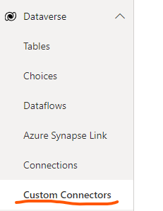
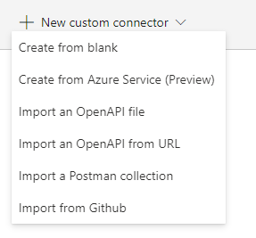
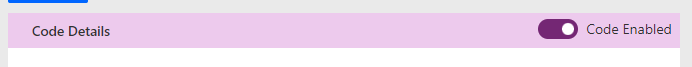
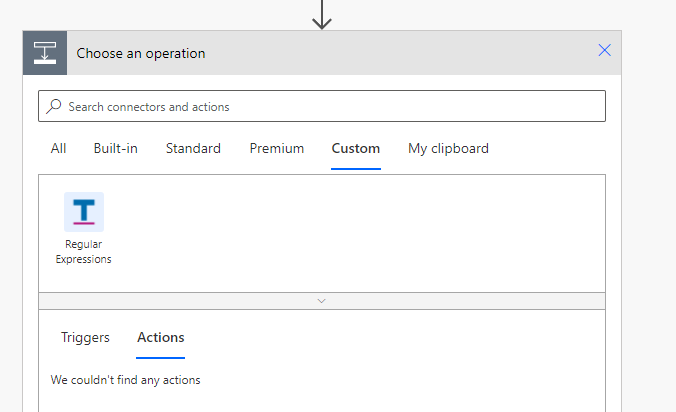

# Installing the connectors

In order to install these connectors to your environment, you will need sufficient permissions to create and publish custom connectors. A detailed overview of what custom connectors can found at [this link](https://docs.microsoft.com/en-us/connectors/custom-connectors/).

## Steps to follow

Access your environment by navigating to [make.powerapps.com](https://make.powerapps.com) and logging in using your work or school account.

Once logged in, access the _Custom Connectors_ area by expanding the _Dataverse_ navigation group on the left hand pane and clicking on the _Custom Connectors_ link

On the _Custom Connectors_ page import the definition file by opening the _New custom connector_ menu and selecting _Import an OpenAPI file_ option.

In the dialog that opens, enter the name of the connector and select the appropriate _*.swagger.json_ file from this repository.

Once imported, in the custom connector editor, select the appropriate icon and add a colour in hex format. For e.g. for the "Regular Expression" connector, use **#e6f0ff** as the Icon background color.

Switch to the _Code (Preview)_ tab in the editor, and ensure that _Code enabled_ is toggled to the **On** position.

Open the appropriate _*.cs_ file from the connector folder in this repository and copy all the contents of the file into the code editor area in that page.

From the _Operations_ drop down, select all the operations to ensure that the code is executed when the user adds any of the actions in the connector.

Click on _Create Connector_ or _Update Connector_ button on the toolbar and wait for Power Automate to complete the save. Once saved, you are free to use the connector in your Flows. You will typically find it in the _Custom_ tab when adding an action.

