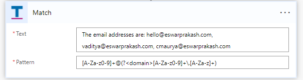
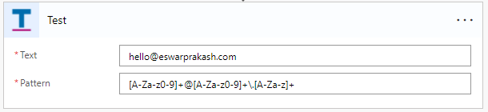
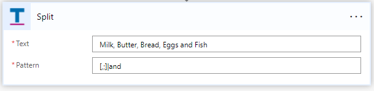
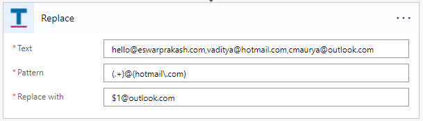

# Regular Expressions
This connector allows Power Automate developers to use regular expressions to manipulate text / string data.

The connector is implemented using the new [_Code_](https://docs.microsoft.com/en-us/connectors/custom-connectors/write-code#script-class) support added and which is currently in preview.

## Triggers
None

## Actions
The connector support 4 actions as detailed below

### **Match**
The action attempts to match provided [regular expression](https://docs.microsoft.com/en-us/dotnet/standard/base-types/regular-expression-language-quick-reference) pattern with a given text and returns all the matches.

In the below example the action returns all the e-mail addresses matched, also extracting the "domain" part of the e-mail address
separately.

The action returns a complex object as detailed below.

| **Attribute** | **Description**                                                                   |
|---------------|-----------------------------------------------------------------------------------|
| matches       | A collection of "match" objects that represents all the matches found in the text |

A match object is structured as below

| **Attribute** | **Description**                                                                   |
|---------------|-----------------------------------------------------------------------------------|
| success       | Indicates if the match was successful                                             |
| index         | The zero based index of the start of the match                                    |
| length        | The length of the text found in the match                                         |
| groups        | A collection of "group" objects representing all the groups captured in the match |

A group object is structured as below

| **Attribute** | **Description**                                        |
|---------------|--------------------------------------------------------|
| success       | Indicates if the group was successfully matched        |
| index         | The zero based index of the start of the matched group |
| length        | The length of the matched group found                  |
| name          | The name of the group that was matched                 |
| value         | The captured value for the group                       |

### **Test**
The action tests the provided [regular expression](https://docs.microsoft.com/en-us/dotnet/standard/base-types/regular-expression-language-quick-reference) pattern with a given text and returns a flag indicating whether the match was successful or not.

In the below example the action returns the string "true" since the pattern matches the provided text - which is a valid e-mail address.

The action returns "true" or "false" depending on whether the text matched the given pattern or not.

### **Split**
The action splits the provided input text into an array of substrings defined by the provided [regular expression](https://docs.microsoft.com/en-us/dotnet/standard/base-types/regular-expression-language-quick-reference) pattern.

In the below example the action returns an array containing the strings "Milk", "Butter", "Bread", "Eggs" and "Fish".

The action returns a collection / array of strings after spliting the text based on the given regular expression pattern.

### **Replace**
The action replaces matches found for a [regular expression](https://docs.microsoft.com/en-us/dotnet/standard/base-types/regular-expression-language-quick-reference) pattern with a specified replacement string or pattern.

In the below example the action replaces hotmail.com with outlook.com and returns the replaced text.

The action returns the text replaced with the provided replacement text / pattern, which matches the provided regular expression pattern.
